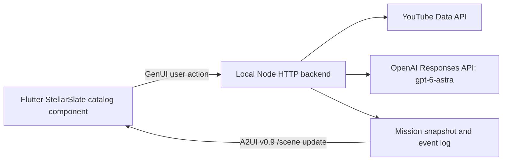

# Architecture

## Responsibilities

Flutter owns deterministic layout, motion, selection, queue presentation, and user interaction. The backend owns evidence candidates, passenger context, semantic decisions, validation, revision sequencing, credentials, and persistence. The current scene is a deliberately small iteration baseline.

`EditorialProvider` isolates semantic ranking. `OpenAIEditorialProvider` sends untrusted metadata as input data with a strict JSON schema. `FixtureEditorialProvider` provides deterministic, explicitly synthetic setup behavior. There is no silent provider fallback.

The YouTube adapter returns API metadata with canonical video URLs and observed timestamps. It does not treat channel names as authority, infer velocity from a single observation, or claim a video has been fact-checked. Publisher/content verification is deferred.

## State and consistency

One local mission per mode is stored in `data/mission-fixture.json` or `data/mission-live.json`; mutation records are appended beside it. Repeated discovery deduplicates stable video IDs and caps the corpus at 40. Passenger programming retains mission identity and updates scene/queue at a single revision.

The HTTP server serializes mutating operations with a busy guard. Actions include the last observed revision; stale or concurrent actions return 409. Decisions must cover each artifact exactly once, reference known IDs, use allowed statuses/clusters, and include at most one NOW item. Invalid model output leaves the current state unchanged.

Snapshot writes use temporary-file rename. The snapshot is the restart authority; the subsequent log append is not transactionally atomic with that rename. A disk failure between them can leave the log behind the snapshot. Before implementing authoritative replay, replace this with transactional storage or a durable event-first reducer.

## A2UI boundary

The app initializes one `stellar-slate` surface and a custom `StellarSlate` root. Subsequent changes replace only `/scene`, preserving component/surface identity while keeping graph, queue, context, and revision consistent. This is genuine A2UI model updating, but not yet the fine-grained per-artifact diff engine described in the final product brief.

The checked setup versions are GenUI 0.10.2 / a2ui_core 0.1.1 / protocol v0.9. Refer to the installed public APIs and [A2UI specification](https://a2ui.org/specification/v0.9-a2ui/), not old `surfaceUpdate` or `beginRendering` examples.

## Boundaries for later iterations

The server binds to loopback and serves the web build from the same origin. It provides no public hosting, multi-user auth, arbitrary URL fetcher, uploads, external messages, or editing of provider data. Do not expose it publicly as-is.

This baseline uses one structured ranking response per action. It does not yet carry a persistent Responses conversation or support asynchronous tools and mid-turn steering. Preserve the domain/provider boundary while adding those features. The earlier local Codex proof remains useful evidence, but it is a different transport and authentication route.
